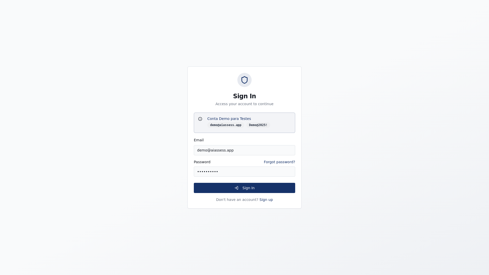
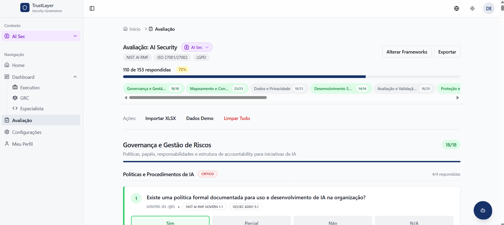
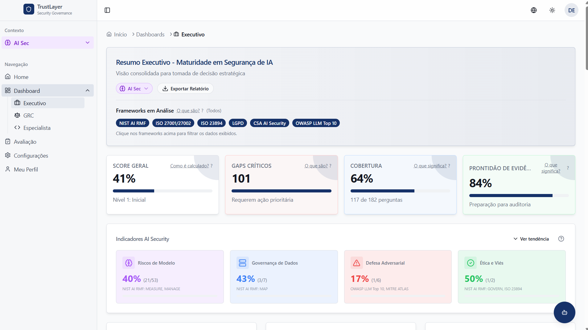
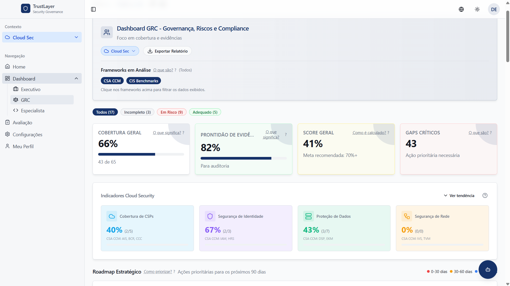
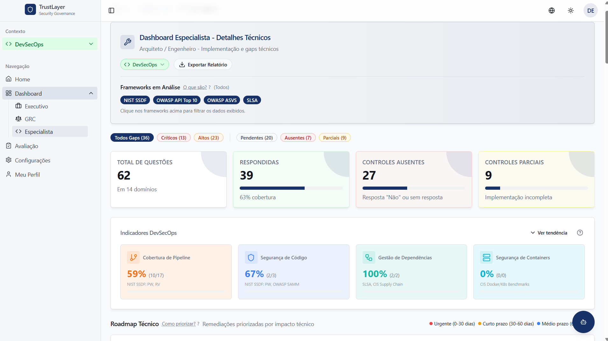
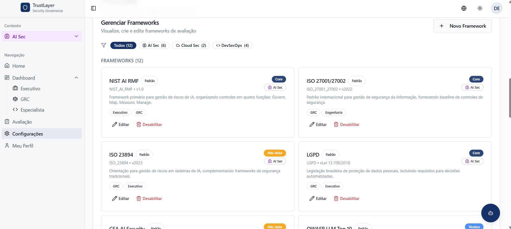

# 🛡️ TrustLayer - Security Governance Platform

Uma plataforma completa de governança de segurança multi-domínio para **AI Security**, **Cloud Security** e **DevSecOps**, baseada em frameworks reconhecidos internacionalmente como NIST AI RMF, ISO 27001/27002, LGPD, CSA CCM, OWASP e outros.

<div align="center">

<!-- Build & Quality -->
[](https://ai-assess-insight.lovable.app)
[](https://ai-assess-insight.lovable.app)
[](https://ai-assess-insight.lovable.app)
[](https://ai-assess-insight.lovable.app)

<!-- Version & Tech -->
[](https://ai-assess-insight.lovable.app)
[](https://react.dev/)
[](https://www.typescriptlang.org/)
[](https://vitejs.dev/)
[](https://tailwindcss.com/)

<!-- Backend & Infra -->
[](https://supabase.com/)
[](https://supabase.com/docs/guides/functions)

<!-- License & Community -->
[](LICENSE)
[](https://ai-assess-insight.lovable.app)
[](https://ai-assess-insight.lovable.app)

<!-- Frameworks Supported -->
[](https://www.nist.gov/)
[](https://www.iso.org/)
[](https://cloudsecurityalliance.org/)
[](https://owasp.org/)

</div>

## 📸 Screenshots

<div align="center">

### 🔐 Login - Autenticação Segura

*Tela de login com credenciais pre-provisionadas*

---

### 📋 Assessment - Questionário de Avaliação

*Questionário estruturado por domínios L1/L2 com campos de evidência*

---

### 📊 Dashboard Executivo

*Visão estratégica com KPIs, gráficos de maturidade e roadmap para CISO*

---

### 📈 Dashboard GRC

*Governança, Riscos e Compliance com cobertura de frameworks e conformidade*

---

### 🔧 Dashboard Especialista

*Detalhes técnicos com métricas por categoria e gaps críticos*

---

### 🤖 Assistente de IA

*Chat interativo com análise contextual do assessment*

---

### ⚙️ Configurações - Gestão de Frameworks

*Gerenciamento de frameworks padrão e customizados*

</div>

---

## 📋 Sobre o Projeto

Esta ferramenta permite que organizações avaliem sua postura de segurança em múltiplos domínios, identificando gaps críticos, gerando roadmaps de remediação e acompanhando a evolução da maturidade ao longo do tempo.

### ✨ Principais Funcionalidades

#### 🎯 Avaliação Multi-Domínio
- **AI Security**: Avaliação baseada em NIST AI RMF, ISO 23894
- **Cloud Security**: Avaliação baseada em CSA CCM, ISO 27017
- **DevSecOps**: Avaliação baseada em NIST SSDF, OWASP

#### 📊 Dashboards Especializados
- **Executivo**: Visão estratégica para CISO e liderança com KPIs consolidados
- **GRC**: Governança, Riscos e Compliance com foco em cobertura de frameworks
- **Especialista**: Detalhes técnicos para arquitetos e engenheiros de segurança

#### 📈 Análise de Tendências
- **Histórico de Maturidade**: Snapshots automáticos diários para acompanhamento temporal
- **Comparação de Períodos**: Visualização side-by-side de diferentes intervalos de tempo
- **Anotações em Gráficos**: Marcação de eventos e milestones importantes
- **Indicadores por Domínio**: Métricas específicas (NIST Functions, CSA Domains, SDLC Phases)

#### 🤖 Assistente de IA
- **Chat Interativo**: Análise contextual do assessment com suporte a múltiplos provedores
- **Provedores de IA Configuráveis**: OpenAI, Claude, Gemini, Ollama, Hugging Face
- **Padrão IA**: Utiliza **Lovable AI Gateway** por padrão (sem necessidade de API key)
  - Modelos suportados: GPT-5, GPT-5-mini, Gemini 2.5 Pro/Flash, entre outros
  - Fallback automático para provedores configurados pelo usuário

#### 🎙️ Sistema de Voz Inteligente

**Text-to-Speech (TTS):**
- **Padrão**: Web Speech API nativa do navegador (sem custo, funciona offline)
- Configurações personalizáveis: idioma, velocidade, tom, volume e voz preferida
- Auto-speak opcional para respostas do assistente

**Speech-to-Text (STT):**
- **Padrão**: Web Speech API (reconhecimento em tempo real, gratuito)
- **Alternativas configuráveis**:
  - OpenAI Whisper (alta precisão, requer API key)
  - Endpoint customizado (para modelos próprios)
- Suporte a transcrição de arquivos de áudio

**Perfil de Voz (Speaker Verification):**
- **Cadastro biométrico**: Grave frases para treinar o sistema a reconhecer sua voz
- **Níveis de enrollment**: Padrão (6 frases, ~2min) ou Avançado (12 frases, ~5min)
- **Verificação automática**: Filtra comandos de vozes não cadastradas
- **Processamento em Web Worker**: Extração de features em background sem bloquear UI
- **Visualização em tempo real**: Barras de áudio que respondem ao volume do microfone
- **Barra de progresso**: Indicador visual durante processamento de áudio
- **Indicador visual**: Mostra status de verificação em tempo real no chat
- **Sensibilidade ajustável**: Slider para calibrar rigor da verificação

**Features de Áudio Extraídas:**
- MFCC (13 coeficientes) - Timbre vocal
- Pitch Mean/Std - Tom de voz
- RMS Energy - Intensidade
- Zero Crossing Rate - Características espectrais
- Speaking Rate - Ritmo da fala

**Comandos de Voz:**
- Navegação entre páginas por comando de voz
- Consulta de dados e métricas
- Troca de domínios de segurança
- Exportação de relatórios

#### 🔗 Integrações
- **SIEM Integration**: Encaminhamento de eventos em JSON, CEF, LEEF, Syslog
- **Monitoramento de Saúde**: Métricas de latência, taxa de sucesso e status de conexão
- **Audit Logging**: Logs detalhados com IP, user-agent e geolocalização

#### 📋 Gestão de Conteúdo
- **Frameworks Customizáveis**: Adicionar, editar ou desabilitar frameworks
- **Questões Personalizadas**: Criar questões específicas da organização
- **Versionamento**: Histórico de alterações com diff e rollback
- **Import/Export**: Importação em massa via Excel e exportação de configurações

#### 🌐 Internacionalização
- Suporte completo a **Português (BR)**, **English (US)** e **Español (ES)**
- Sincronização de preferência de idioma no perfil do usuário

#### 📄 Exportação de Relatórios
- **HTML Standalone**: Relatórios fiéis ao estado atual do dashboard
- **Gráficos SVG**: Visualizações vetoriais de alta qualidade
- **Roadmap Estratégico**: Priorização em horizontes de 30/60/90 dias

## 🛠️ Stack Tecnológica

| Tecnologia | Uso |
|------------|-----|
| [React 18](https://react.dev/) | Framework UI |
| [TypeScript](https://www.typescriptlang.org/) | Tipagem estática |
| [Vite](https://vitejs.dev/) | Build tool e dev server |
| [Tailwind CSS](https://tailwindcss.com/) | Estilização |
| [shadcn/ui](https://ui.shadcn.com/) | Componentes UI |
| [Zustand](https://zustand-demo.pmnd.rs/) | Gerenciamento de estado |
| [Recharts](https://recharts.org/) | Visualização de dados |
| [Supabase](https://supabase.com/) | Backend (banco de dados, auth, edge functions) |
| [TanStack Query](https://tanstack.com/query) | Gerenciamento de dados assíncronos |
| [React Router](https://reactrouter.com/) | Roteamento |
| [i18next](https://www.i18next.com/) | Internacionalização |
| [ExcelJS](https://github.com/exceljs/exceljs) | Importação/Exportação Excel |
| [Web Speech API](https://developer.mozilla.org/en-US/docs/Web/API/Web_Speech_API) | TTS/STT nativo do navegador |
| [Web Audio API](https://developer.mozilla.org/en-US/docs/Web/API/Web_Audio_API) | Análise de áudio em tempo real |
| [Web Workers](https://developer.mozilla.org/en-US/docs/Web/API/Web_Workers_API) | Processamento em background |
| [Framer Motion](https://www.framer.com/motion/) | Animações |

## 🔊 Configuração Padrão de IA e Voz

### Inteligência Artificial

| Configuração | Padrão | Alternativas |
|--------------|--------|--------------|
| **Gateway** | Lovable AI Gateway | Provedores customizados |
| **Modelo LLM** | GPT-5 / Gemini 2.5 Pro | GPT-5-mini, Gemini Flash, Claude, Ollama |
| **API Key** | Não necessária (gateway) | Obrigatória para provedores externos |
| **Contexto** | Assessment atual + histórico | Personalizável por provedor |

### Síntese de Voz (TTS)

| Configuração | Padrão | Faixa |
|--------------|--------|-------|
| **Provedor** | Web Speech API | Nativo do navegador |
| **Idioma** | pt-BR | pt-BR, en-US, es-ES |
| **Velocidade** | 1.0x | 0.5x - 2.0x |
| **Tom (Pitch)** | 1.0 | 0.5 - 2.0 |
| **Volume** | 1.0 | 0.0 - 1.0 |
| **Auto-Speak** | Desativado | Ativável por toggle |

### Reconhecimento de Voz (STT)

| Configuração | Padrão | Alternativas |
|--------------|--------|--------------|
| **Provedor** | Web Speech API | OpenAI Whisper, Custom Endpoint |
| **Modo** | Tempo real | Transcrição de arquivo (Whisper) |
| **Idioma** | pt-BR | Configurável no perfil |
| **API Key** | Não necessária | Obrigatória para Whisper |

### Perfil de Voz (Verificação de Locutor)

| Configuração | Padrão | Descrição |
|--------------|--------|-----------|
| **Status** | Desativado | Ativado após enrollment |
| **Nível** | Padrão (6 frases) | Avançado (12 frases) disponível |
| **Sensibilidade** | 65% | Ajustável de 40% a 90% |
| **Processamento** | Web Worker | Background thread, não bloqueia UI |
| **Visualização** | Tempo real | 12 barras de frequência animadas |
| **Features** | MFCC, Pitch, Spectral, Energy | Análise multi-dimensional |

## 📦 Pré-requisitos

- **Node.js** 18.x ou superior
- **npm** 9.x ou superior (ou yarn/pnpm)

## 🚀 Instalação e Execução Local

### 1. Clone o repositório

```bash
git clone https://github.com/trustlayer/trustlayer.git
cd trustlayer
```

### 2. Instale as dependências

```bash
npm install
```

### 3. Execute o servidor de desenvolvimento

```bash
npm run dev
```

A aplicação estará disponível em `http://localhost:5173`

> **Nota**: O backend utiliza Supabase self-hosted ou Postgres externo, conforme o modo de implantacao.

## 📜 Scripts Disponíveis

| Comando | Descrição |
|---------|-----------|
| `npm run dev` | Inicia o servidor de desenvolvimento |
| `npm run build` | Gera build de produção |
| `npm run preview` | Visualiza o build de produção localmente |
| `npm run lint` | Executa o linter (ESLint) |
| `npm run test` | Executa os testes |

## 📁 Estrutura do Projeto

```
src/
├── components/           # Componentes React reutilizáveis
│   ├── ui/              # Componentes shadcn/ui
│   ├── dashboard/       # Componentes de dashboard
│   ├── settings/        # Componentes de configuração
│   ├── ai-assistant/    # Componentes do assistente IA
│   └── auth/            # Componentes de autenticação
├── data/                # Dados estáticos (frameworks, questões, taxonomia)
├── hooks/               # Custom React hooks
├── i18n/                # Arquivos de internacionalização
│   └── locales/         # Traduções (pt-BR, en-US, es-ES)
├── integrations/        # Integrações externas (Supabase)
├── lib/                 # Utilitários e lógica de negócio
│   ├── database.ts      # Operações de banco de dados
│   ├── scoring.ts       # Cálculos de maturidade e métricas
│   ├── frameworks.ts    # Gerenciamento de frameworks
│   ├── securityDomains.ts # Gerenciamento de domínios
│   ├── siemIntegration.ts # Integração SIEM
│   ├── auditLog.ts      # Sistema de auditoria
│   └── stores.ts        # Stores Zustand
├── pages/               # Páginas da aplicação
│   ├── Home.tsx         # Página inicial com onboarding
│   ├── Assessment.tsx   # Questionário de avaliação
│   ├── Dashboard*.tsx   # Dashboards (Executive, GRC, Specialist)
│   ├── Profile.tsx      # Perfil do usuário
│   └── Settings.tsx     # Configurações
└── test/                # Testes

supabase/
├── functions/           # Edge Functions
│   ├── ai-assistant/    # Assistente de IA
│   ├── audit-log/       # Registro de auditoria
│   ├── siem-forward/    # Encaminhamento SIEM
│   ├── init-demo-data/  # (removido em builds enterprise)
│   └── init-demo-user/  # (removido em builds enterprise)
└── config.toml          # Configuração Supabase
```

## 🗄️ Banco de Dados

### Principais Tabelas

| Tabela | Descrição |
|--------|-----------|
| `security_domains` | Domínios de segurança (AI, Cloud, DevSecOps) |
| `domains` | Categorias L1 da taxonomia |
| `subcategories` | Subcategorias L2 da taxonomia |
| `default_questions` | Questões padrão do sistema |
| `custom_questions` | Questões personalizadas do usuário |
| `answers` | Respostas do assessment |
| `default_frameworks` | Frameworks padrão |
| `custom_frameworks` | Frameworks personalizados |
| `assessment_meta` | Metadados (frameworks habilitados/selecionados) |
| `maturity_snapshots` | Histórico de maturidade |
| `chart_annotations` | Anotações em gráficos |
| `ai_providers` | Configurações de provedores IA |
| `siem_integrations` | Integrações SIEM |
| `siem_metrics` | Métricas de saúde SIEM |
| `change_logs` | Logs de auditoria |
| `question_versions` | Versionamento de questões |
| `profiles` | Perfis de usuário |
| `voice_profiles` | Perfis de voz para verificação de locutor |
| `voice_enrollment_samples` | Amostras de áudio do enrollment |

## 🎯 Fluxo de Uso

1. **Login**: Acesse com suas credenciais fornecidas pelo administrador
2. **Selecione o Domínio**: Escolha entre AI Security, Cloud Security ou DevSecOps
3. **Configure Frameworks**: Habilite os frameworks relevantes para sua organização
4. **Avaliação**: Responda às questões (Sim/Parcial/Não/NA) com evidências
5. **Dashboards**: Analise métricas, gaps e roadmap por perfil (Executivo/GRC/Especialista)
6. **Compare Períodos**: Visualize evolução comparando diferentes intervalos de tempo
7. **Exporte**: Gere relatórios HTML para compartilhamento

## 🔒 Segurança

- **Row Level Security (RLS)**: Habilitado em todas as tabelas
- **Autenticação**: Contas provisionadas pelo administrador; SSO opcional (OIDC/SAML)
- **Rate Limiting**: Proteção contra brute-force no login
- **Validação de Senha**: Requisitos de complexidade (8+ chars, maiúsculas, números, símbolos)
- **Auditoria**: Logs detalhados de todas as ações
- **Isolamento Multi-Tenant**: Dados segregados por usuário e domínio

## 🧪 Testes

```bash
# Executar todos os testes
npm run test

# Testes incluem:
# - Validação de chaves i18n
# - Consistência de placeholders
# - Snapshots de traduções
```

## 🤝 Contribuindo

Contribuições são bem-vindas! Por favor:

1. Faça um fork do projeto
2. Crie uma branch para sua feature (`git checkout -b feature/nova-feature`)
3. Commit suas mudanças (`git commit -m 'Adiciona nova feature'`)
4. Push para a branch (`git push origin feature/nova-feature`)
5. Abra um Pull Request

## 📄 Licença

Este projeto está sob a licença MIT. Veja o arquivo [LICENSE](LICENSE) para mais detalhes.

## 📞 Suporte

- Abra uma issue para reportar bugs
- Discussões e sugestões são bem-vindas

## 📚 Documentação Adicional

- [API Reference](docs/API.md) - Documentação das Edge Functions
- [Architecture](docs/ARCHITECTURE.md) - Diagramas de arquitetura do sistema
- [Contributing](docs/CONTRIBUTING.md) - Guia de contribuição
- [Changelog](docs/CHANGELOG.md) - Histórico de mudanças
- [LLM Reference](llm.txt) - Referência para assistentes de IA

## Documentation Policy

- Every feature, fix, or change must update the relevant docs, including README, llm.txt, and CHANGELOG.

---

Desenvolvido com ❤️ para a comunidade de segurança
