# 🏗️ TrustLayer - Arquitetura do Sistema

Documentação técnica da arquitetura da plataforma TrustLayer de Governança de Segurança Multi-Domínio.

---

## 📋 Índice

- [Visão Geral](#visão-geral)
- [Arquitetura de Alto Nível](#arquitetura-de-alto-nível)
- [Camadas da Aplicação](#camadas-da-aplicação)
- [Fluxo de Dados](#fluxo-de-dados)
- [Modelo de Dados](#modelo-de-dados)
- [Componentes do Frontend](#componentes-do-frontend)
- [Edge Functions](#edge-functions)
- [Segurança](#segurança)
- [Integrações](#integrações)

---

## 🎯 Visão Geral

TrustLayer é uma plataforma SPA (Single Page Application) construída com React e TypeScript, utilizando Supabase como backend-as-a-service para persistência, autenticação e funções serverless.

### Princípios Arquiteturais

- **Multi-Tenant**: Isolamento de dados por usuário via RLS (Row Level Security)
- **Multi-Domínio**: Separação lógica de AI Security, Cloud Security e DevSecOps
- **Offline-First**: Cache local com Zustand para resiliência
- **Event-Driven**: Sistema de auditoria baseado em eventos
- **Modular**: Componentes reutilizáveis e hooks customizados

---

## 🏛️ Arquitetura de Alto Nível

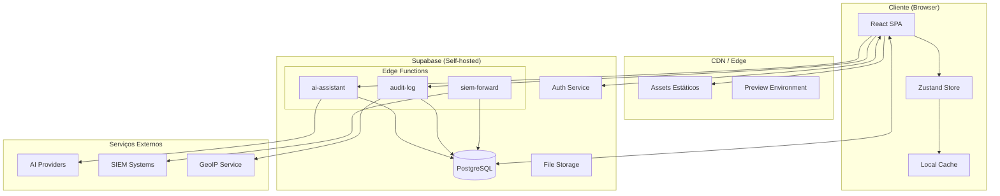

---

## 📚 Camadas da Aplicação

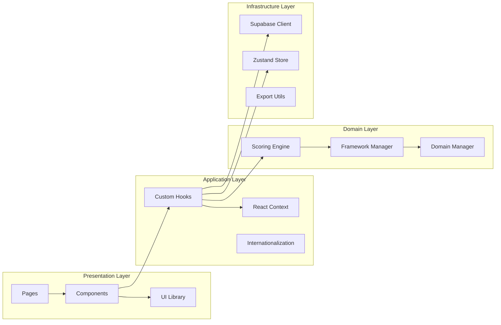

### Estrutura de Diretórios

```
src/
├── components/           # Componentes React
│   ├── ui/              # shadcn/ui components
│   ├── dashboard/       # Dashboard components
│   ├── settings/        # Settings components
│   ├── ai-assistant/    # AI Assistant components
│   └── auth/            # Auth components
├── pages/               # Route pages
├── hooks/               # Custom React hooks
├── lib/                 # Business logic & utilities
├── data/                # Static JSON data
├── i18n/                # Internationalization
└── integrations/        # External integrations
```

---

## 🔄 Fluxo de Dados

### Assessment Flow

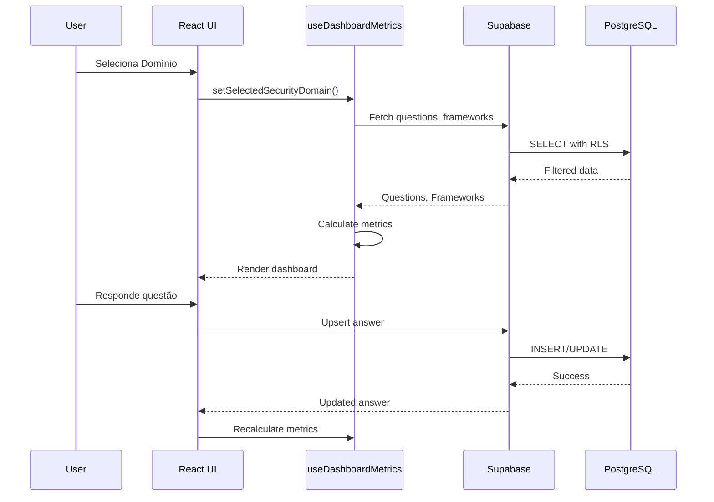

### AI Assistant Flow

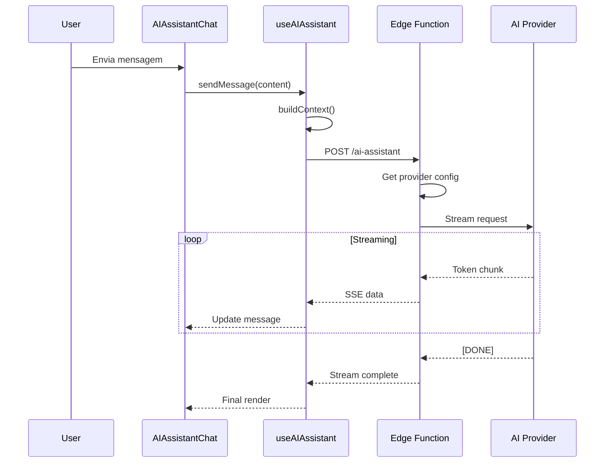

### Audit & SIEM Flow

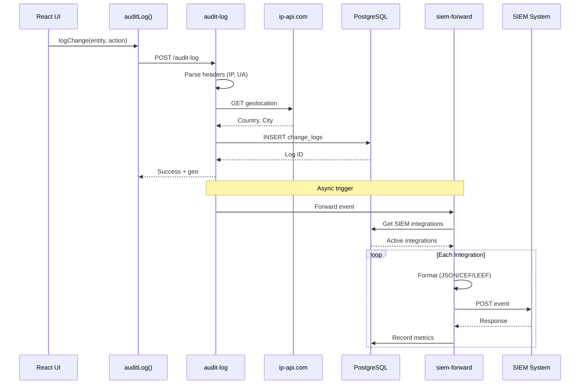

---

## 🗃️ Modelo de Dados

### Entity Relationship Diagram

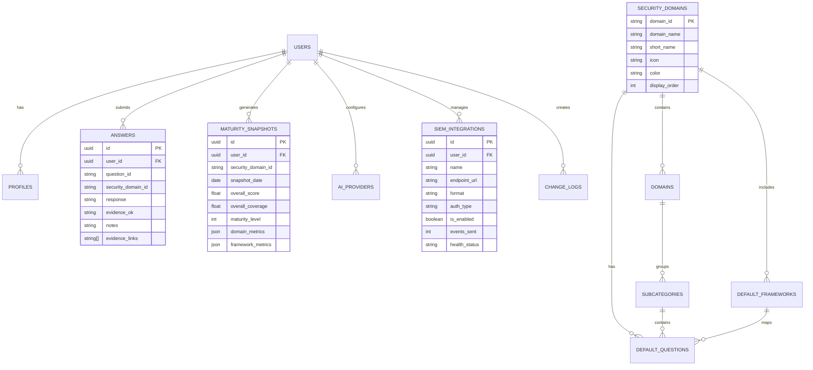

### Tabelas Principais

| Tabela | Propósito | RLS |
|--------|-----------|-----|
| `security_domains` | Domínios (AI, Cloud, DevSecOps) | Read: auth |
| `domains` | Categorias L1 da taxonomia | Read: auth |
| `subcategories` | Subcategorias L2 | Read: auth |
| `default_questions` | Questões padrão | Read: auth |
| `custom_questions` | Questões do usuário | CRUD: owner |
| `answers` | Respostas do assessment | CRUD: owner |
| `maturity_snapshots` | Histórico de maturidade | CRUD: owner |
| `ai_providers` | Configurações de IA | CRUD: owner |
| `siem_integrations` | Integrações SIEM | CRUD: owner |
| `change_logs` | Logs de auditoria | Insert: auth, Read: owner |

---

## 🧩 Componentes do Frontend

### Hierarquia de Componentes

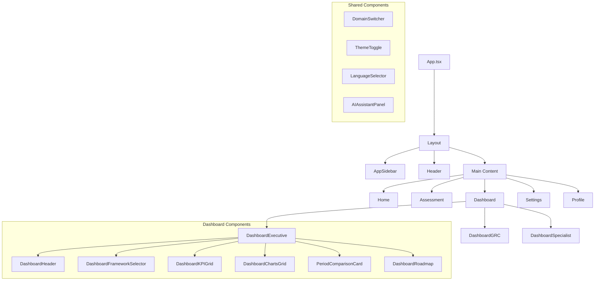

### Hooks Principais

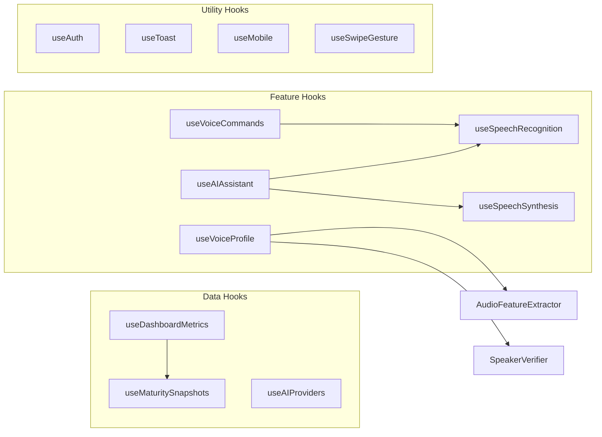

### Voice Profile System

O sistema de perfil de voz permite cadastrar e verificar a identidade do usuário através de características vocais.

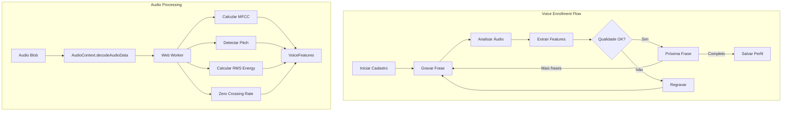

#### Componentes do Sistema de Voz

| Componente | Arquivo | Descrição |
|------------|---------|-----------|
| `useVoiceProfile` | `src/hooks/useVoiceProfile.ts` | Hook principal para enrollment e verificação |
| `AudioFeatureExtractor` | `src/lib/voiceProfile/audioFeatureExtractor.ts` | Extração de features com Web Worker |
| `SpeakerVerifier` | `src/lib/voiceProfile/speakerVerifier.ts` | Verificação de identidade vocal |
| `VoiceProfileCard` | `src/components/settings/VoiceProfileCard.tsx` | UI de cadastro e gerenciamento |

#### Features Extraídas

| Feature | Descrição | Uso |
|---------|-----------|-----|
| MFCC (13 coeficientes) | Mel-Frequency Cepstral Coefficients | Timbre vocal |
| Pitch Mean/Std | Frequência fundamental média e variação | Tom de voz |
| RMS Energy | Energia média do sinal | Volume/intensidade |
| Zero Crossing Rate | Taxa de cruzamento por zero | Características espectrais |
| Spectral Centroid | Centro de massa espectral | Brilho do som |
| Speaking Rate | Taxa de fala estimada | Ritmo da fala |

#### Web Worker para Processamento

O processamento de áudio é feito em um Web Worker para não bloquear a UI:

```typescript
// Worker inline criado via Blob
const workerCode = `
  function extractFeatures(samples, sampleRate) {
    return {
      mfcc: calculateSimplifiedMFCC(samples),
      spectralCentroid: estimateSpectralCentroid(samples, sampleRate),
      // ... outras features
    };
  }
  
  self.onmessage = function(event) {
    const { type, id, data } = event.data;
    const features = extractFeatures(data.samples, data.sampleRate);
    self.postMessage({ type: 'result', id, data: features });
  };
`;
```

#### Visualização de Áudio em Tempo Real

Durante a gravação, o hook expõe `audioLevels` (array de 12 valores 0-1) que representam os níveis de frequência em tempo real:

```typescript
// No hook useVoiceProfile
const startAudioAnalysis = (stream: MediaStream) => {
  const audioContext = new AudioContext();
  const analyser = audioContext.createAnalyser();
  analyser.fftSize = 64;
  
  const source = audioContext.createMediaStreamSource(stream);
  source.connect(analyser);
  
  const updateLevels = () => {
    analyser.getByteFrequencyData(dataArray);
    // Mapear para 12 barras
    setAudioLevels(levels);
    requestAnimationFrame(updateLevels);
  };
};
```

### State Management

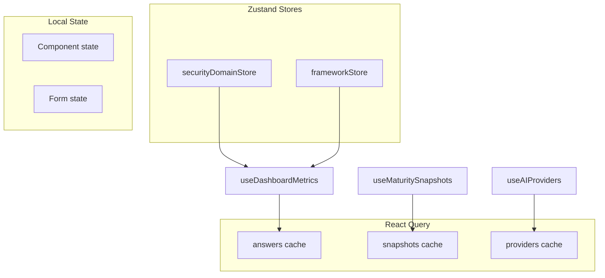

---

## ⚡ Edge Functions

### Arquitetura das Functions

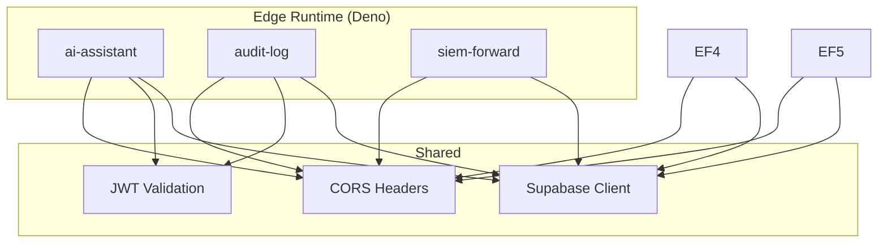

### AI Assistant - Provider Router

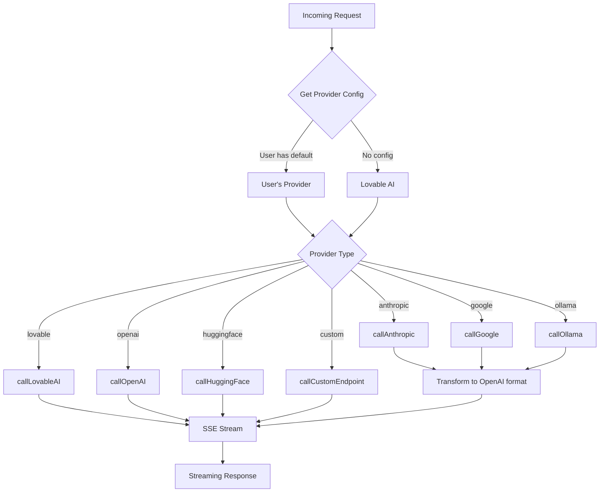

---

## 🔒 Segurança

### Modelo de Segurança

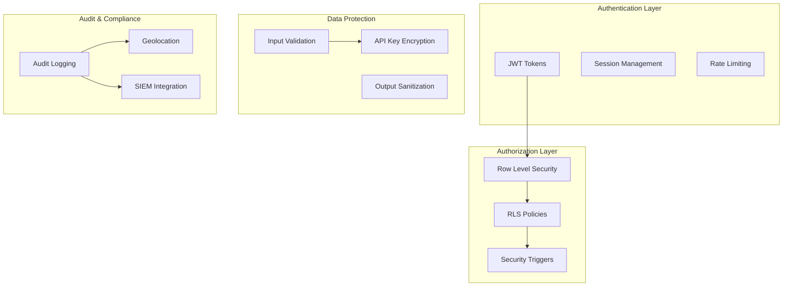

### RLS Policy Pattern

```sql
-- Padrão: Usuário só acessa seus próprios dados
CREATE POLICY "Users can CRUD own data"
ON public.answers
FOR ALL
USING (auth.uid() = user_id)
WITH CHECK (auth.uid() = user_id);

-- Padrão: Dados de referência são read-only
CREATE POLICY "Reference data is read-only"
ON public.default_questions
FOR SELECT
USING (auth.uid() IS NOT NULL);
```

### Trigger de Segurança

```sql
-- Auto-populate user_id on insert
CREATE TRIGGER set_user_id
BEFORE INSERT ON public.answers
FOR EACH ROW
EXECUTE FUNCTION public.set_current_user_id();
```

---

## 🔗 Integrações

### Diagrama de Integrações

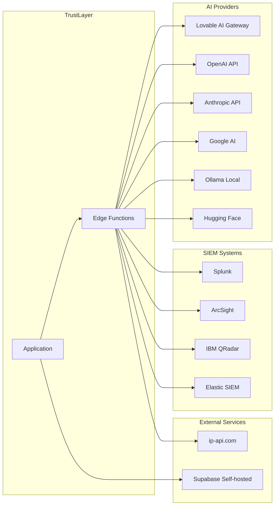

### Formatos de Integração SIEM

| Formato | Destinos Compatíveis |
|---------|---------------------|
| JSON | Splunk, Elastic, Custom |
| CEF | ArcSight, Splunk, McAfee |
| LEEF | IBM QRadar |
| Syslog | Qualquer SIEM |

---

## 📊 Métricas e Monitoramento

### Dashboard Metrics Pipeline

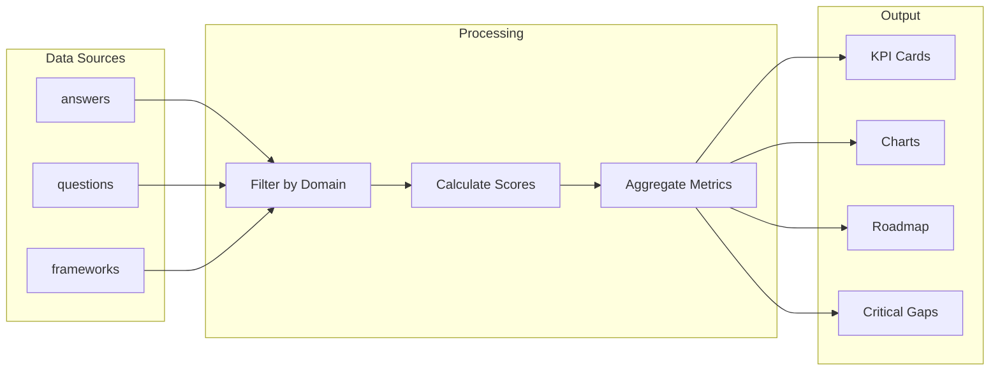

### Cálculo de Maturidade

```typescript
// Scoring weights
const RESPONSE_WEIGHTS = {
  'Sim': 1.0,      // Full compliance
  'Parcial': 0.5,  // Partial compliance
  'Não': 0.0,      // Non-compliance
  'NA': null,      // Not applicable (excluded)
};

// Maturity levels
const MATURITY_LEVELS = [
  { level: 1, name: 'Inicial', minScore: 0 },
  { level: 2, name: 'Básico', minScore: 35 },
  { level: 3, name: 'Intermediário', minScore: 50 },
  { level: 4, name: 'Avançado', minScore: 65 },
  { level: 5, name: 'Otimizado', minScore: 80 },
];
```

---

## 🚀 Deploy e Infraestrutura

### Ambiente de Deploy

```mermaid
graph TB
    subgraph "Development"
        Local[localhost:5173]
        DevDB[Dev Database]
    end
    
    subgraph "Preview"
        Preview[preview.lovable.app]
        PreviewDB[Preview Database]
    end
    
    subgraph "Production"
        Prod[ai-assess-insight.lovable.app]
        ProdDB[Production Database]
        CDN[CDN Edge]
    end
    
    Local --> DevDB
    Preview --> PreviewDB
    Prod --> CDN
    CDN --> ProdDB
```

### CI/CD Pipeline

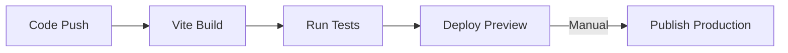

---

## Ajustes Enterprise (Melhores Praticas)

- Backend primario: Supabase self-hosted; suporta Postgres externo (RDS/BDS) quando exigido.
- Topologias: in-cluster, split frontend/backend, ou on-prem completo.
- Dados de dominios/frameworks/perguntas: somente via banco de dados.
- Admin Console: configuracoes globais, integracoes e saude; acesso restrito.
- User Settings: apenas preferencias do perfil (voz, idioma, tema, etc.).
- Provisionamento: sem auto-cadastro; admin cria usuarios locais ou integra LDAP/EntraID.
- Demo: funcoes e dados de demo removidos em builds enterprise.
- XLSX: importacao com validacao, limites de tamanho, audit logs e pipeline seguro.
- Seguranca: baseline de sessao, API, rate limits e hardening operacional.
- Documentacao: README, llm.txt, docs e CHANGELOG atualizados a cada mudanca.

## 📚 Referências Técnicas

- [React 18 Documentation](https://react.dev/)
- [Supabase Documentation](https://supabase.com/docs)
- [Tailwind CSS](https://tailwindcss.com/docs)
- [shadcn/ui](https://ui.shadcn.com/)
- [Zustand](https://docs.pmnd.rs/zustand)
- [TanStack Query](https://tanstack.com/query/latest)
- [Recharts](https://recharts.org/en-US/)
- [i18next](https://www.i18next.com/)
