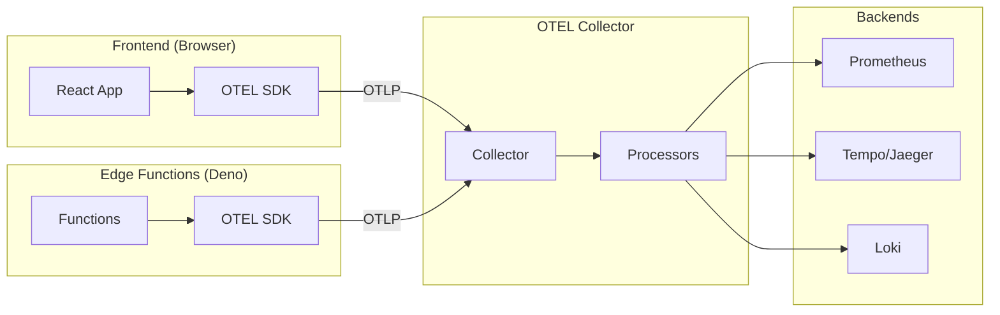

# OpenTelemetry Integration Guide

Este guia detalha como configurar e usar OpenTelemetry (OTEL) no TrustLayer para observabilidade completa com traces, metrics e logs.

---

## 📋 Índice

- [Visão Geral](#visão-geral)
- [Arquitetura](#arquitetura)
- [Configuração](#configuração)
- [Instrumentação Frontend](#instrumentação-frontend)
- [Instrumentação Backend](#instrumentação-backend)
- [Métricas Customizadas](#métricas-customizadas)
- [Distributed Tracing](#distributed-tracing)
- [Exporters](#exporters)
- [Dashboards e Visualização](#dashboards-e-visualização)
- [Troubleshooting](#troubleshooting)

---

## 🎯 Visão Geral

OpenTelemetry fornece observabilidade unificada através de:

- **Traces**: Rastreamento de requisições end-to-end
- **Metrics**: Métricas de performance e negócio
- **Logs**: Logs estruturados correlacionados com traces

### Benefícios

- ✅ **Vendor-neutral**: Funciona com qualquer backend (Jaeger, Tempo, Prometheus, etc.)
- ✅ **Auto-instrumentation**: Instrumenta fetch, XHR, clicks automaticamente
- ✅ **Distributed tracing**: Rastreamento através de frontend → Edge Functions → database
- ✅ **SLO tracking**: Métricas alinhadas aos SLOs definidos
- ✅ **Business metrics**: Métricas específicas do domínio de negócio

---

## 🏗️ Arquitetura



### Componentes

| Componente | Função |
|------------|--------|
| **Frontend SDK** | Instrumenta navegador (fetch, clicks, page loads) |
| **Edge Functions SDK** | Instrumenta serverless functions (Deno) |
| **OTEL Collector** | Recebe, processa e exporta telemetria |
| **Prometheus** | Armazena métricas |
| **Tempo/Jaeger** | Armazena traces |
| **Loki** | Armazena logs |
| **Grafana** | Visualização unificada |

---

## ⚙️ Configuração

### 1. Instalar Dependências (Frontend)

```bash
npm install --save \
  @opentelemetry/sdk-trace-web \
  @opentelemetry/sdk-metrics \
  @opentelemetry/auto-instrumentations-web \
  @opentelemetry/exporter-trace-otlp-http \
  @opentelemetry/exporter-metrics-otlp-http \
  @opentelemetry/resources \
  @opentelemetry/semantic-conventions \
  @opentelemetry/context-zone
```

### 2. Configurar OTEL Collector

#### Via Helm

```yaml
# values.yaml
observability:
  otelCollector:
    enabled: true
    replicaCount: 2

    config:
      receivers:
        otlp:
          protocols:
            http:
              endpoint: 0.0.0.0:4318
            grpc:
              endpoint: 0.0.0.0:4317

      processors:
        batch:
          timeout: 10s
          send_batch_size: 1024

        resource:
          attributes:
            - key: deployment.environment
              value: production
              action: upsert

      exporters:
        prometheus:
          endpoint: "0.0.0.0:8889"

        otlp/tempo:
          endpoint: "tempo:4317"
          tls:
            insecure: true

        loki:
          endpoint: "http://loki:3100/loki/api/v1/push"

      service:
        pipelines:
          traces:
            receivers: [otlp]
            processors: [batch, resource]
            exporters: [otlp/tempo]

          metrics:
            receivers: [otlp]
            processors: [batch, resource]
            exporters: [prometheus]

          logs:
            receivers: [otlp]
            processors: [batch, resource]
            exporters: [loki]
```

#### Standalone (Docker Compose)

```yaml
# docker-compose.yml
version: '3.8'

services:
  otel-collector:
    image: otel/opentelemetry-collector-contrib:0.91.0
    command: ["--config=/etc/otel-collector-config.yaml"]
    volumes:
      - ./otel-collector-config.yaml:/etc/otel-collector-config.yaml
    ports:
      - "4317:4317"   # OTLP gRPC
      - "4318:4318"   # OTLP HTTP
      - "8889:8889"   # Prometheus exporter

  tempo:
    image: grafana/tempo:latest
    command: ["-config.file=/etc/tempo.yaml"]
    volumes:
      - ./tempo.yaml:/etc/tempo.yaml
    ports:
      - "3200:3200"   # Tempo
      - "4317"        # OTLP gRPC

  prometheus:
    image: prom/prometheus:latest
    volumes:
      - ./prometheus.yml:/etc/prometheus/prometheus.yml
    ports:
      - "9090:9090"

  grafana:
    image: grafana/grafana:latest
    ports:
      - "3000:3000"
    environment:
      - GF_AUTH_ANONYMOUS_ENABLED=true
```

### 3. Configurar Frontend

```typescript
// src/main.tsx
import { initializeTelemetry } from '@/lib/observability/telemetry';
import { initializeMetrics, initializeSLOMetrics } from '@/lib/observability/metrics';

// Initialize OpenTelemetry
initializeTelemetry({
  serviceName: 'trustlayer-frontend',
  serviceVersion: '1.2.0',
  environment: import.meta.env.MODE,  // development, staging, production
  collectorUrl: import.meta.env.VITE_OTEL_COLLECTOR_URL || 'http://localhost:4318',
  tracingSampleRate: import.meta.env.MODE === 'production' ? 0.1 : 1.0,  // 10% sampling in prod
  enabled: import.meta.env.VITE_OTEL_ENABLED === 'true',
});

// Initialize custom metrics
initializeMetrics();
initializeSLOMetrics();

ReactDOM.createRoot(document.getElementById('root')!).render(
  <React.StrictMode>
    <App />
  </React.StrictMode>,
);
```

### 4. Variáveis de Ambiente

```bash
# .env
VITE_OTEL_ENABLED=true
VITE_OTEL_COLLECTOR_URL=http://localhost:4318

# Production
# VITE_OTEL_COLLECTOR_URL=https://otel-collector.trustlayer.example.com
```

---

## 🌐 Instrumentação Frontend

### Auto-Instrumentation

O OTEL SDK instrumenta automaticamente:

- **Fetch API**: Requisições HTTP/HTTPS
- **XMLHttpRequest**: Requisições AJAX
- **Document Load**: Page load performance
- **User Interactions**: Clicks, submits, keypresses

### Custom Instrumentation

#### Traces

```typescript
import { traceAsync, traceSync } from '@/lib/observability/telemetry';

// Async function
const loadDashboard = async () => {
  return traceAsync(
    'dashboard.load',
    async () => {
      const data = await fetchDashboardData();
      return processDashboard(data);
    },
    { dashboardType: 'executive', domain: 'AI_SECURITY' }
  );
};

// Sync function
const calculateScore = (answers: Answer[]) => {
  return traceSync(
    'scoring.calculate',
    () => {
      return computeMaturityScore(answers);
    },
    { answerCount: answers.length }
  );
};
```

#### Metrics

```typescript
import {
  recordDashboardLoad,
  recordAssessmentCompletion,
  recordAIAssistantLatency,
} from '@/lib/observability/metrics';

// Record dashboard load time
const startTime = Date.now();
await loadDashboard();
const duration = Date.now() - startTime;

recordDashboardLoad(duration, {
  dashboardType: 'executive',
  domain: 'AI_SECURITY',
});

// Record assessment completion
recordAssessmentCompletion(1200, {  // 20 minutes
  domain: 'CLOUD_SECURITY',
  framework: 'CSA_CCM',
  questionsAnswered: 36,
});

// Record AI assistant latency
recordAIAssistantLatency(850, {
  provider: 'openai',
  model: 'gpt-4',
  success: true,
});
```

#### React Hooks

```typescript
import { usePageViewTracking, useRenderTracking } from '@/lib/observability/metrics';

export function DashboardExecutive() {
  // Track page view duration
  const trackPageView = usePageViewTracking('DashboardExecutive');

  useEffect(() => {
    return trackPageView;  // Cleanup on unmount
  }, []);

  // Track component render time
  const trackRender = useRenderTracking('DashboardExecutive');

  useEffect(() => {
    trackRender();
  }, [data]);  // Track re-renders when data changes

  return <div>...</div>;
}
```

---

## 🖥️ Instrumentação Backend (Edge Functions)

### Configurar Telemetria

```typescript
// supabase/functions/ai-assistant/index.ts
import { serve } from "https://deno.land/std@0.168.0/http/server.ts";
import { initEdgeTelemetry, tracedHandler, withSpan } from "../_shared/telemetry.ts";

// Initialize once
initEdgeTelemetry('ai-assistant');

// Wrap handler
serve(tracedHandler('ai-assistant-request', async (req) => {
  // Your handler code...

  // Create child spans
  const user = await withSpan('fetch-user', async () => {
    return await supabase.auth.getUser(token);
  }, { user_id: userId });

  const response = await withSpan('call-ai-provider', async () => {
    return await fetch(aiProviderUrl, options);
  }, { provider: 'openai', model: 'gpt-4' });

  return new Response(JSON.stringify(data));
}));
```

### Ambiente

```bash
# supabase/functions/.env
OTEL_COLLECTOR_URL=http://otel-collector:4318
ENVIRONMENT=production
```

---

## 📊 Métricas Customizadas

### Métricas de Negócio

```typescript
// Assessment completion rate
const assessmentCompletionRate = meter.createHistogram('trustlayer.assessment.completion_rate', {
  description: 'Percentage of questions answered',
  unit: '%',
});

assessmentCompletionRate.record(85.5, {
  domain: 'AI_SECURITY',
  framework: 'NIST_AI_RMF',
});

// Framework usage
const frameworkUsage = meter.createCounter('trustlayer.framework.usage', {
  description: 'Number of times a framework is enabled',
});

frameworkUsage.add(1, { framework: 'ISO_27001' });

// Critical gaps
const criticalGaps = meter.createUpDownCounter('trustlayer.gaps.critical', {
  description: 'Number of critical security gaps',
});

criticalGaps.add(3, { domain: 'CLOUD_SECURITY' });
```

### SLO Metrics

```typescript
import { recordLoginAttempt } from '@/lib/observability/metrics';

// Track login attempts for SLO
try {
  await signIn(email, password);
  recordLoginAttempt(true, { method: 'email' });
} catch (error) {
  recordLoginAttempt(false, { method: 'email' });
}

// Calculate SLO in Prometheus
// (sum(rate(trustlayer_slo_login_successes[28d])) /
//  sum(rate(trustlayer_slo_login_attempts[28d]))) * 100
```

---

## 🔗 Distributed Tracing

### Trace Propagation

O OTEL SDK propaga automaticamente o contexto de trace via headers HTTP:

```
traceparent: 00-4bf92f3577b34da6a3ce929d0e0e4736-00f067aa0ba902b7-01
```

### Exemplo de Trace Completo

```
User clicks "Load Dashboard" (frontend)
  └─ dashboard.load (frontend span)
      ├─ fetch /api/dashboard-data (auto-instrumented)
      │   └─ dashboard-data-request (Edge Function span)
      │       ├─ verify-jwt (Edge Function child span)
      │       ├─ fetch-answers (Edge Function child span)
      │       │   └─ PostgreSQL query (DB span)
      │       └─ calculate-metrics (Edge Function child span)
      └─ render-dashboard (frontend span)
```

### Visualização no Grafana

```promql
# Traces with errors
{ status_code="ERROR" }

# Slow traces (> 2s)
{ duration > 2s }

# Traces for specific user
{ user_id="abc-123" }
```

---

## 📤 Exporters

### Prometheus Exporter

```yaml
# Prometheus scrape config
scrape_configs:
  - job_name: 'otel-collector'
    static_configs:
      - targets: ['otel-collector:8889']
```

### Tempo/Jaeger Exporter

```yaml
# Tempo config
distributor:
  receivers:
    otlp:
      protocols:
        grpc:
          endpoint: 0.0.0.0:4317

storage:
  trace:
    backend: s3
    s3:
      bucket: trustlayer-traces
      endpoint: s3.amazonaws.com
```

### Loki Exporter

```yaml
# Loki config
schema_config:
  configs:
    - from: 2023-01-01
      store: boltdb-shipper
      object_store: s3
      schema: v11
      index:
        prefix: loki_index_
        period: 24h
```

---

## 📈 Dashboards e Visualização

### Grafana Data Sources

```yaml
# datasources.yaml
apiVersion: 1

datasources:
  - name: Prometheus
    type: prometheus
    access: proxy
    url: http://prometheus:9090

  - name: Tempo
    type: tempo
    access: proxy
    url: http://tempo:3200

  - name: Loki
    type: loki
    access: proxy
    url: http://loki:3100
```

### Exemplo de Dashboard

```json
{
  "dashboard": {
    "title": "TrustLayer - Traces & Latency",
    "panels": [
      {
        "title": "Request Latency (P95)",
        "targets": [
          {
            "expr": "histogram_quantile(0.95, sum(rate(http_request_duration_seconds_bucket[5m])) by (le))"
          }
        ]
      },
      {
        "title": "Trace Duration",
        "datasource": "Tempo",
        "targets": [
          {
            "query": "{service.name=\"trustlayer-frontend\"}"
          }
        ]
      }
    ]
  }
}
```

### Queries Úteis

#### Prometheus

```promql
# P95 latency by endpoint
histogram_quantile(0.95,
  sum(rate(http_request_duration_seconds_bucket[5m])) by (le, endpoint)
)

# Request rate
sum(rate(http_requests_total[5m])) by (status_code)

# Error rate
sum(rate(http_requests_total{status_code=~"5.."}[5m]))
/
sum(rate(http_requests_total[5m]))
```

#### Tempo (TraceQL)

```traceql
# Slow traces
{ duration > 2s }

# Errors in AI assistant
{ service.name="trustlayer-functions-ai-assistant" && status.code=ERROR }

# Traces for specific user
{ resource.user_id="user-123" }
```

---

## 🔍 Troubleshooting

### Traces não aparecem

**Problema**: Nenhum trace é exportado.

**Solução**:
1. Verifique se OTEL está habilitado: `VITE_OTEL_ENABLED=true`
2. Verifique URL do collector: `VITE_OTEL_COLLECTOR_URL`
3. Verifique console do navegador para erros
4. Verifique se o collector está rodando: `curl http://localhost:4318/v1/traces`

### Métricas não aparecem no Prometheus

**Problema**: Métricas não são scraped.

**Solução**:
1. Verifique se o collector está expondo métricas: `curl http://localhost:8889/metrics`
2. Verifique scrape config do Prometheus
3. Verifique labels no Prometheus: `up{job="otel-collector"}`

### Alto overhead de performance

**Problema**: Aplicação lenta após habilitar OTEL.

**Solução**:
1. Reduza sample rate: `tracingSampleRate: 0.1` (10%)
2. Aumente batch size no collector
3. Desabilite instrumentações não essenciais

### Traces fragmentados

**Problema**: Traces não conectam frontend → backend.

**Solução**:
1. Verifique se trace propagation está habilitada
2. Verifique CORS headers: `traceparent` deve ser permitido
3. Verifique se ambos os lados usam W3C Trace Context

---

## 📚 Referências

- [OpenTelemetry Docs](https://opentelemetry.io/docs/)
- [OTEL JavaScript SDK](https://github.com/open-telemetry/opentelemetry-js)
- [OTEL Collector](https://opentelemetry.io/docs/collector/)
- [Grafana Tempo](https://grafana.com/docs/tempo/latest/)
- [Prometheus](https://prometheus.io/docs/)

---

**Pronto!** Seu TrustLayer está com observabilidade completa via OpenTelemetry. 🎉

Para suporte, consulte [CONTRIBUTING.md](./CONTRIBUTING.md) ou abra uma issue.
