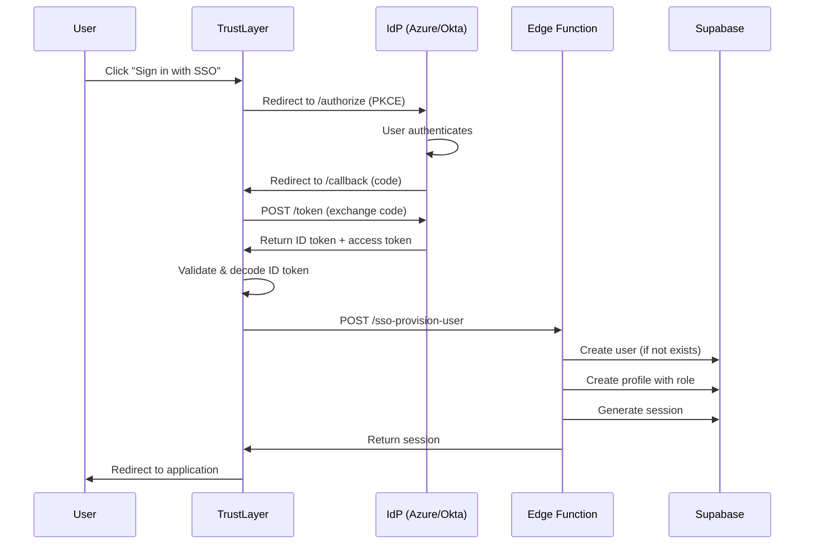

# SSO Integration Guide

TrustLayer suporta integração com provedores de identidade via **OIDC (OpenID Connect)** e **SAML 2.0** para autenticação Single Sign-On (SSO).

---

## 📋 Índice

- [Visão Geral](#visão-geral)
- [Provedores Suportados](#provedores-suportados)
- [OIDC Integration](#oidc-integration)
- [SAML Integration](#saml-integration)
- [Just-in-Time Provisioning](#just-in-time-provisioning)
- [Role Mapping](#role-mapping)
- [Configuração por Ambiente](#configuração-por-ambiente)
- [Troubleshooting](#troubleshooting)

---

## 🎯 Visão Geral

A integração SSO permite que usuários façam login no TrustLayer utilizando credenciais corporativas gerenciadas por sistemas de identidade como:

- Azure AD (Entra ID)
- Okta
- Keycloak
- Google Workspace
- Auth0
- Outros provedores compatíveis com OIDC/SAML

### Benefícios

- ✅ **Autenticação centralizada** - Um único login para todos os sistemas
- ✅ **Just-in-Time Provisioning** - Usuários são criados automaticamente no primeiro login
- ✅ **Role mapping automático** - Grupos/roles do IdP mapeados para roles do TrustLayer
- ✅ **Segurança aprimorada** - MFA e políticas de senha gerenciadas centralmente
- ✅ **Auditoria** - Logs detalhados de eventos de autenticação

---

## 🌐 Provedores Suportados

| Provedor | OIDC | SAML | Status |
|----------|------|------|--------|
| **Azure AD (Entra ID)** | ✅ | ✅ | Testado |
| **Okta** | ✅ | ✅ | Testado |
| **Keycloak** | ✅ | ✅ | Testado |
| **Google Workspace** | ✅ | ✅ | Testado |
| **Auth0** | ✅ | ❌ | Testado |
| **OneLogin** | ✅ | ✅ | Suportado |
| **Ping Identity** | ✅ | ✅ | Suportado |
| **Generic OIDC** | ✅ | ❌ | Suportado |
| **Generic SAML** | ❌ | ✅ | Suportado |

---

## 🔐 OIDC Integration

### 1. Configurar Aplicação no IdP

#### Azure AD (Entra ID)

```bash
# 1. Acesse Azure Portal → Azure Active Directory → App registrations
# 2. Clique em "New registration"

Name: TrustLayer
Redirect URI: https://trustlayer.example.com/auth/callback
Supported account types: Accounts in this organizational directory only

# 3. Após criação, anote:
Application (client) ID: abc123-def456-...
Directory (tenant) ID: xyz789-...

# 4. Em "Certificates & secrets", crie um client secret
# Anote o secret value (será exibido apenas uma vez)

# 5. Em "API permissions", adicione:
- Microsoft Graph → User.Read
- Microsoft Graph → Group.Read.All (opcional, para role mapping)

# 6. Em "Token configuration", adicione optional claims:
- ID token: email, groups, preferred_username
```

#### Okta

```bash
# 1. Acesse Okta Admin Console → Applications → Create App Integration
# 2. Escolha "OIDC - OpenID Connect"
# 3. Escolha "Web Application"

App integration name: TrustLayer
Grant type: Authorization Code
Sign-in redirect URIs: https://trustlayer.example.com/auth/callback
Sign-out redirect URIs: https://trustlayer.example.com/logout

# 4. Após criação, anote:
Client ID: 0oa...
Client Secret: ...

# 5. Em "Assignments", atribua usuários ou grupos
```

#### Keycloak

```bash
# 1. Acesse Keycloak Admin Console → Clients → Create
Client ID: trustlayer
Client Protocol: openid-connect
Access Type: confidential

# 2. Em "Settings":
Valid Redirect URIs: https://trustlayer.example.com/auth/callback
Web Origins: https://trustlayer.example.com

# 3. Em "Credentials", anote:
Secret: ...

# 4. Em "Mappers", adicione:
- groups: Mapeie grupos do Keycloak para o claim "groups"
```

### 2. Configurar TrustLayer

Crie ou edite o arquivo de configuração SSO:

```typescript
// src/config/sso.ts
import { OIDCConfig } from '@/lib/sso/oidcProvider';

export const ssoConfig: OIDCConfig = {
  // Azure AD
  provider: 'azure',
  issuerUrl: 'https://login.microsoftonline.com/{tenant-id}/v2.0',
  clientId: 'abc123-def456-...',
  clientSecret: 'env:AZURE_CLIENT_SECRET',  // Stored securely
  redirectUri: 'https://trustlayer.example.com/auth/callback',
  scopes: ['openid', 'email', 'profile', 'Group.Read.All'],

  // Claim mapping
  claimMapping: {
    email: 'email',
    name: 'name',
    groups: 'groups',
  },

  // Role mapping (Azure AD group → TrustLayer role)
  roleMapping: {
    'TrustLayer-Admins': 'admin',
    'TrustLayer-Managers': 'manager',
    'TrustLayer-Analysts': 'analyst',
    'TrustLayer-Viewers': 'viewer',
  },

  // PKCE enabled by default
  pkceEnabled: true,
};

// Okta
export const oktaSsoConfig: OIDCConfig = {
  provider: 'okta',
  issuerUrl: 'https://your-domain.okta.com/oauth2/default',
  clientId: '0oa...',
  clientSecret: 'env:OKTA_CLIENT_SECRET',
  redirectUri: 'https://trustlayer.example.com/auth/callback',
  scopes: ['openid', 'email', 'profile', 'groups'],

  claimMapping: {
    email: 'email',
    name: 'name',
    groups: 'groups',
  },

  roleMapping: {
    'TrustLayer Admins': 'admin',
    'TrustLayer Managers': 'manager',
    'TrustLayer Analysts': 'analyst',
    'TrustLayer Viewers': 'viewer',
  },
};

// Keycloak
export const keycloakSsoConfig: OIDCConfig = {
  provider: 'keycloak',
  issuerUrl: 'https://keycloak.example.com/realms/trustlayer',
  clientId: 'trustlayer',
  clientSecret: 'env:KEYCLOAK_CLIENT_SECRET',
  redirectUri: 'https://trustlayer.example.com/auth/callback',
  scopes: ['openid', 'email', 'profile', 'groups'],

  claimMapping: {
    email: 'email',
    name: 'preferred_username',
    groups: 'groups',
  },

  roleMapping: {
    '/trustlayer/admins': 'admin',
    '/trustlayer/managers': 'manager',
    '/trustlayer/analysts': 'analyst',
    '/trustlayer/viewers': 'viewer',
  },
};
```

### 3. Atualizar Variáveis de Ambiente

```bash
# .env
AZURE_CLIENT_SECRET=your-azure-secret
OKTA_CLIENT_SECRET=your-okta-secret
KEYCLOAK_CLIENT_SECRET=your-keycloak-secret
```

### 4. Integrar no Login Page

```typescript
// src/pages/Login.tsx
import { SSOLoginButton } from '@/components/auth/SSOLoginButton';
import { ssoConfig } from '@/config/sso';

export default function Login() {
  return (
    <div>
      {/* Existing email/password login */}

      <div className="relative my-4">
        <div className="absolute inset-0 flex items-center">
          <span className="w-full border-t" />
        </div>
        <div className="relative flex justify-center text-xs uppercase">
          <span className="bg-background px-2 text-muted-foreground">
            Or continue with
          </span>
        </div>
      </div>

      <SSOLoginButton config={ssoConfig} />
    </div>
  );
}
```

### 5. Adicionar Rota de Callback

```typescript
// src/App.tsx
import { SSOCallbackHandler } from '@/components/auth/SSOLoginButton';

<Route path="/auth/callback" element={<SSOCallbackHandler />} />
```

---

## 🔒 SAML Integration

### 1. Configurar Aplicação SAML no IdP

#### Azure AD SAML

```bash
# 1. Acesse Azure Portal → Azure Active Directory → Enterprise Applications
# 2. Clique em "New application" → "Create your own application"

Name: TrustLayer
Select: Integrate any other application you don't find in the gallery (Non-gallery)

# 3. Após criação, vá para "Single sign-on" → SAML

# 4. Basic SAML Configuration:
Identifier (Entity ID): https://trustlayer.example.com/saml/metadata
Reply URL (ACS URL): https://trustlayer.example.com/auth/saml/acs
Sign on URL: https://trustlayer.example.com

# 5. SAML Signing Certificate:
Download: Certificate (Base64)

# 6. Set up TrustLayer:
Login URL: https://login.microsoftonline.com/{tenant-id}/saml2
Azure AD Identifier: https://sts.windows.net/{tenant-id}/

# 7. User Attributes & Claims:
- email: user.mail
- firstName: user.givenname
- lastName: user.surname
- groups: user.groups (optional)
```

#### Okta SAML

```bash
# 1. Acesse Okta Admin Console → Applications → Create App Integration
# 2. Escolha "SAML 2.0"

General Settings:
App name: TrustLayer

SAML Settings:
Single sign on URL: https://trustlayer.example.com/auth/saml/acs
Audience URI (SP Entity ID): https://trustlayer.example.com/saml/metadata
Name ID format: EmailAddress
Application username: Email

Attribute Statements:
email → user.email
firstName → user.firstName
lastName → user.lastName
groups → appuser.groups (optional)

# 3. Após criação, vá para "Sign On" tab
# Download: SAML Signing Certificate (X.509)
# Anote: Metadata URL ou Identity Provider metadata
```

#### Keycloak SAML

```bash
# 1. Acesse Keycloak Admin Console → Clients → Create
Client ID: https://trustlayer.example.com/saml/metadata
Client Protocol: saml
Client SAML Endpoint: https://trustlayer.example.com/auth/saml/acs

# 2. Em "Settings":
Name ID Format: email
Valid Redirect URIs: https://trustlayer.example.com/*
Master SAML Processing URL: https://trustlayer.example.com/auth/saml/acs

# 3. Em "SAML Keys":
Import ou Generate key pair para SP (optional)

# 4. Em "Mappers", adicione:
- email: User Property → email
- firstName: User Property → firstName
- lastName: User Property → lastName
- groups: Group list (optional)

# 5. Download SAML Descriptor (Realm Settings → SAML 2.0 Identity Provider Metadata)
```

#### Google Workspace SAML

```bash
# 1. Acesse Google Admin Console → Apps → Web and mobile apps
# 2. Clique em "Add App" → "Add custom SAML app"

App details:
App name: TrustLayer

Google Identity Provider details:
Download: IDP metadata XML
Anote: SSO URL e Entity ID

Service Provider details:
ACS URL: https://trustlayer.example.com/auth/saml/acs
Entity ID: https://trustlayer.example.com/saml/metadata
Name ID format: EMAIL
Name ID: Primary email

Attribute mapping:
email → Primary email
firstName → First name
lastName → Last name
```

### 2. Configurar TrustLayer (SAML)

```typescript
// src/config/sso.ts
import { SAMLConfig } from '@/lib/sso/samlProvider';

export const samlConfig: SAMLConfig = {
  // Azure AD SAML
  provider: 'azure-saml',

  // IdP Configuration (from Azure)
  idpEntityId: 'https://sts.windows.net/{tenant-id}/',
  idpSsoUrl: 'https://login.microsoftonline.com/{tenant-id}/saml2',
  idpCertificate: `-----BEGIN CERTIFICATE-----
MIIC8DCCAdigAwIBAgIQFKdF...
-----END CERTIFICATE-----`,

  // SP Configuration
  spEntityId: 'https://trustlayer.example.com/saml/metadata',
  acsUrl: 'https://trustlayer.example.com/auth/saml/acs',

  // SAML Settings
  nameIdFormat: 'email',
  wantAssertionsSigned: true,
  wantResponseSigned: false,

  // Attribute mapping (Azure AD attribute names)
  attributeMapping: {
    email: 'http://schemas.xmlsoap.org/ws/2005/05/identity/claims/emailaddress',
    firstName: 'http://schemas.xmlsoap.org/ws/2005/05/identity/claims/givenname',
    lastName: 'http://schemas.xmlsoap.org/ws/2005/05/identity/claims/surname',
    displayName: 'http://schemas.microsoft.com/identity/claims/displayname',
    groups: 'http://schemas.microsoft.com/ws/2008/06/identity/claims/groups',
  },

  // Role mapping (Azure AD group ObjectId → TrustLayer role)
  roleMapping: {
    'abc123-def456-...': 'admin',     // TrustLayer-Admins group ID
    'xyz789-abc123-...': 'manager',   // TrustLayer-Managers group ID
    'def456-xyz789-...': 'analyst',   // TrustLayer-Analysts group ID
    'ghi012-def456-...': 'viewer',    // TrustLayer-Viewers group ID
  },
};

// Okta SAML
export const oktaSamlConfig: SAMLConfig = {
  provider: 'okta-saml',

  idpEntityId: 'http://www.okta.com/exk...',
  idpSsoUrl: 'https://your-domain.okta.com/app/trustlayer/exk.../sso/saml',
  idpCertificate: `-----BEGIN CERTIFICATE-----
...
-----END CERTIFICATE-----`,

  spEntityId: 'https://trustlayer.example.com/saml/metadata',
  acsUrl: 'https://trustlayer.example.com/auth/saml/acs',

  nameIdFormat: 'email',
  wantAssertionsSigned: true,

  attributeMapping: {
    email: 'email',
    firstName: 'firstName',
    lastName: 'lastName',
    groups: 'groups',
  },

  roleMapping: {
    'TrustLayer Admins': 'admin',
    'TrustLayer Managers': 'manager',
    'TrustLayer Analysts': 'analyst',
    'TrustLayer Viewers': 'viewer',
  },
};

// Keycloak SAML
export const keycloakSamlConfig: SAMLConfig = {
  provider: 'custom-saml',

  idpEntityId: 'https://keycloak.example.com/realms/trustlayer',
  idpSsoUrl: 'https://keycloak.example.com/realms/trustlayer/protocol/saml',
  idpCertificate: `-----BEGIN CERTIFICATE-----
...
-----END CERTIFICATE-----`,

  spEntityId: 'https://trustlayer.example.com/saml/metadata',
  acsUrl: 'https://trustlayer.example.com/auth/saml/acs',

  nameIdFormat: 'email',
  wantAssertionsSigned: false,

  attributeMapping: {
    email: 'email',
    firstName: 'firstName',
    lastName: 'lastName',
    groups: 'groups',
  },

  roleMapping: {
    '/trustlayer/admins': 'admin',
    '/trustlayer/managers': 'manager',
    '/trustlayer/analysts': 'analyst',
    '/trustlayer/viewers': 'viewer',
  },
};
```

### 3. Integrar no Login Page (SAML)

```typescript
// src/pages/Login.tsx
import { SSOLoginButton } from '@/components/auth/SSOLoginButton';
import { samlConfig } from '@/config/sso';

export default function Login() {
  return (
    <div>
      {/* Existing email/password login */}

      <div className="relative my-4">
        <div className="absolute inset-0 flex items-center">
          <span className="w-full border-t" />
        </div>
        <div className="relative flex justify-center text-xs uppercase">
          <span className="bg-background px-2 text-muted-foreground">
            Or continue with
          </span>
        </div>
      </div>

      {/* SAML Login */}
      <SSOLoginButton config={samlConfig} protocol="saml" />
    </div>
  );
}
```

### 4. Adicionar Rotas de Callback (SAML)

```typescript
// src/App.tsx
import { SAMLCallbackHandler, SAMLACSPage } from '@/components/auth/SAMLCallbackHandler';

// ACS endpoint (receives SAML POST)
<Route path="/auth/saml/acs" element={<SAMLACSPage />} />

// Callback handler
<Route path="/auth/saml/callback" element={<SAMLCallbackHandler />} />
```

### 5. Gerar Metadados SP (SAML)

Para configurar o IdP, você precisará fornecer os metadados do Service Provider:

```typescript
import { generateSPMetadata } from '@/lib/sso/samlProvider';
import { samlConfig } from '@/config/sso';

const metadata = generateSPMetadata(samlConfig);
console.log(metadata);
```

Ou acesse via endpoint:

```bash
curl https://trustlayer.example.com/auth/saml/metadata
```

### 6. Deploy Edge Function

```bash
# Deploy SAML validation function
supabase functions deploy saml-validate
```

### SAML vs OIDC: Quando Usar?

| Critério | OIDC | SAML |
|----------|------|------|
| **Simplicidade** | ✅ Mais simples | ❌ Mais complexo |
| **Tamanho do token** | ✅ Pequeno (JWT) | ❌ Grande (XML) |
| **Mobile-friendly** | ✅ Sim | ❌ Limitado |
| **Enterprise legacy** | ❌ Limitado | ✅ Amplo suporte |
| **Federal/Gov** | ❌ Raro | ✅ Comum |
| **SPA support** | ✅ Excelente (PKCE) | ❌ Requer backend |

**Recomendação**: Use OIDC quando possível. Use SAML apenas se requerido por policy ou legacy IdP.

---

## 🔄 Just-in-Time Provisioning

Quando um usuário faz login pela primeira vez via SSO:

1. **Validação do token OIDC** - O ID token é validado contra o issuer
2. **Extração de claims** - Email, nome e grupos são extraídos do token
3. **Mapeamento de role** - Grupos do IdP são mapeados para roles do TrustLayer
4. **Criação do usuário** - Um novo usuário é criado via Edge Function (service role)
5. **Criação do perfil** - O perfil é criado com o role mapeado
6. **Geração de sessão** - Uma sessão Supabase é criada
7. **Redirecionamento** - O usuário é redirecionado para a aplicação

### Fluxo de Autenticação



---

## 🎭 Role Mapping

### Estratégias de Mapping

#### 1. **Group-based Mapping** (Recomendado)

Mapeia grupos do IdP para roles do TrustLayer:

```typescript
roleMapping: {
  'TrustLayer-Admins': 'admin',
  'TrustLayer-Managers': 'manager',
  'TrustLayer-Analysts': 'analyst',
  'TrustLayer-Viewers': 'viewer',
}
```

**Prioridade**: Se um usuário pertence a múltiplos grupos, o primeiro match é usado.

#### 2. **Attribute-based Mapping**

Mapeia atributos customizados do IdP:

```typescript
claimMapping: {
  roles: 'custom:trustlayer_role',
}

roleMapping: {
  'admin': 'admin',
  'manager': 'manager',
  'analyst': 'analyst',
  'viewer': 'viewer',
}
```

#### 3. **Default Role**

Se nenhum grupo/role for mapeado, o usuário recebe o role `viewer` (somente leitura).

### Roles no TrustLayer

| Role | Permissões |
|------|-----------|
| **admin** | Acesso total, incluindo Admin Console e configurações globais |
| **manager** | Criar/editar assessments, gerenciar frameworks customizados |
| **analyst** | Responder assessments, visualizar dashboards |
| **viewer** | Apenas visualização (read-only) |

---

## ⚙️ Configuração por Ambiente

### Development

```typescript
export const ssoConfig: OIDCConfig = {
  provider: 'keycloak',
  issuerUrl: 'http://localhost:8080/realms/trustlayer',
  clientId: 'trustlayer-dev',
  redirectUri: 'http://localhost:5173/auth/callback',
  pkceEnabled: true,
};
```

### Staging

```typescript
export const ssoConfig: OIDCConfig = {
  provider: 'azure',
  issuerUrl: 'https://login.microsoftonline.com/{tenant-id}/v2.0',
  clientId: 'staging-client-id',
  redirectUri: 'https://staging.trustlayer.example.com/auth/callback',
};
```

### Production

```typescript
export const ssoConfig: OIDCConfig = {
  provider: 'azure',
  issuerUrl: 'https://login.microsoftonline.com/{tenant-id}/v2.0',
  clientId: 'prod-client-id',
  clientSecret: 'env:AZURE_CLIENT_SECRET',
  redirectUri: 'https://trustlayer.example.com/auth/callback',
};
```

---

## 🔍 Troubleshooting

### Erro: "State mismatch"

**Causa**: O parâmetro `state` não corresponde ao armazenado.

**Solução**:
- Limpe o cache do navegador
- Verifique se cookies estão habilitados
- Verifique se há múltiplas guias abertas

### Erro: "Email claim is required"

**Causa**: O ID token não contém o claim `email`.

**Solução**:
- Verifique os escopos solicitados (`openid email profile`)
- Configure optional claims no IdP
- Ajuste `claimMapping.email` se o claim tiver outro nome

### Erro: "User already exists"

**Causa**: Usuário já existe no Supabase (email duplicado).

**Solução**:
- O usuário deve usar a conta existente
- Ou, um admin deve deletar a conta antiga

### Erro: "Failed to exchange code"

**Causa**: Client secret inválido ou redirect URI não registrado.

**Solução**:
- Verifique o client secret
- Verifique se o redirect URI está cadastrado no IdP exatamente como configurado

### Logs de Debug

Habilite logs detalhados:

```typescript
// src/lib/sso/oidcProvider.ts
const DEBUG = true;

if (DEBUG) {
  console.log('OIDC Config:', config);
  console.log('ID Token:', idToken);
  console.log('User:', user);
}
```

---

## 📊 Auditoria

Todos os eventos de SSO são registrados em `change_logs`:

```sql
SELECT
  created_at,
  entity_type,
  action,
  changes->>'sso_provider' as provider,
  ip_address,
  user_agent
FROM change_logs
WHERE action IN ('sso_provision', 'sso_signin')
ORDER BY created_at DESC;
```

---

## 🚀 Próximos Passos

- [ ] **SCIM Provisioning**: Sincronização automática de usuários via SCIM 2.0
- [ ] **SAML Support**: Implementar parser SAML 2.0
- [ ] **MFA Enforcement**: Validar MFA claims do IdP
- [ ] **Session Management**: Sincronizar logout entre IdP e TrustLayer

---

## 📚 Referências

- [OpenID Connect Core 1.0](https://openid.net/specs/openid-connect-core-1_0.html)
- [PKCE RFC 7636](https://datatracker.ietf.org/doc/html/rfc7636)
- [Azure AD OIDC](https://learn.microsoft.com/en-us/azure/active-directory/develop/v2-protocols-oidc)
- [Okta OIDC](https://developer.okta.com/docs/reference/api/oidc/)
- [Keycloak OIDC](https://www.keycloak.org/docs/latest/securing_apps/#_oidc)

---

**Pronto!** Seu TrustLayer está integrado com SSO. 🎉

Para suporte, consulte [CONTRIBUTING.md](./CONTRIBUTING.md) ou abra uma issue.
